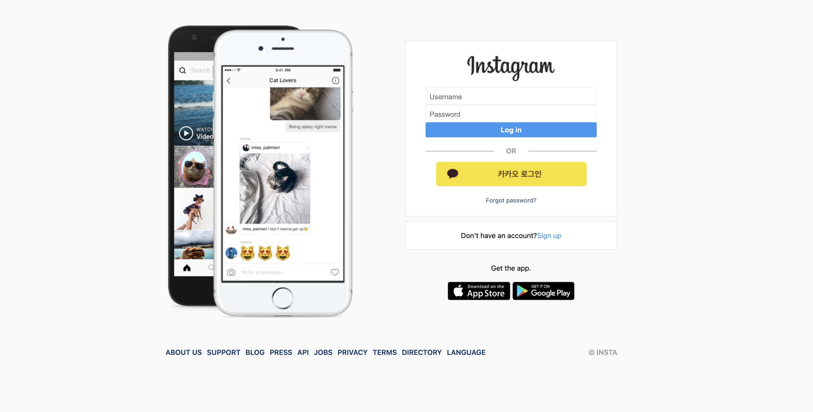
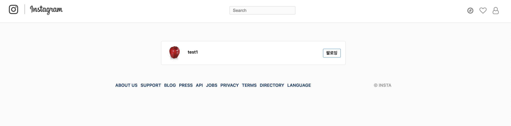
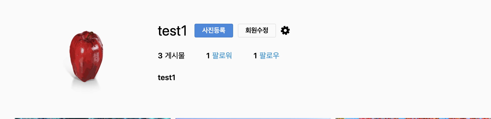
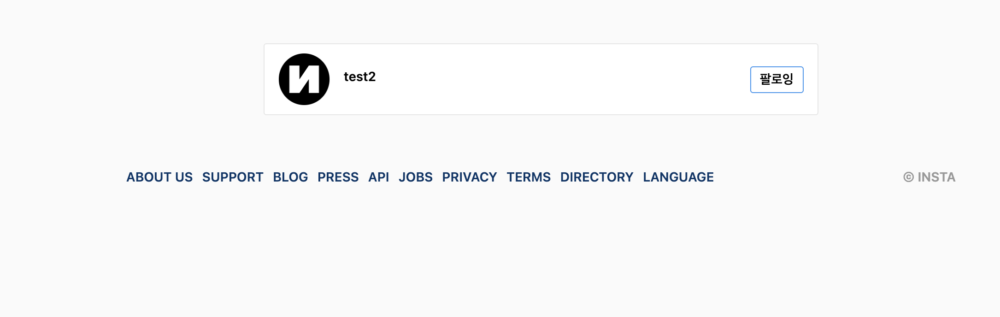
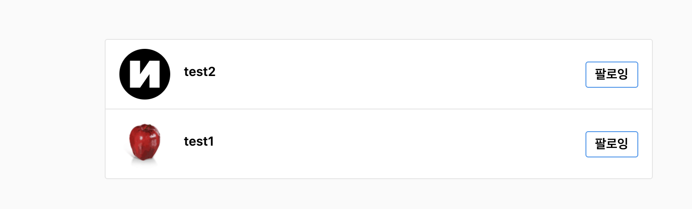
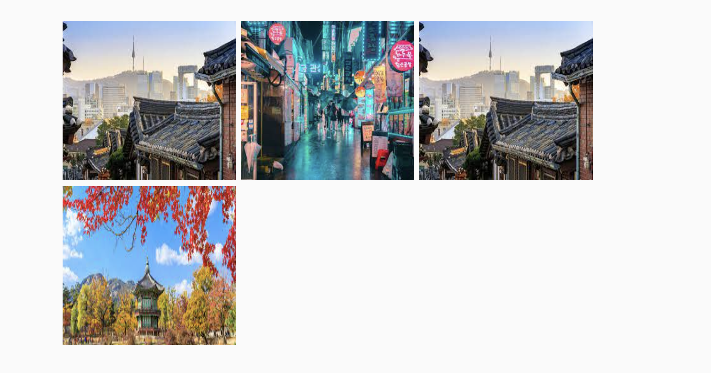
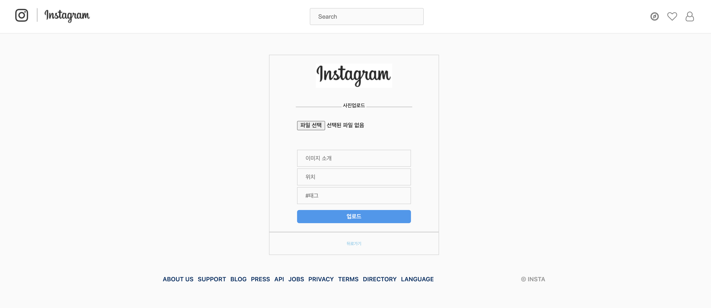
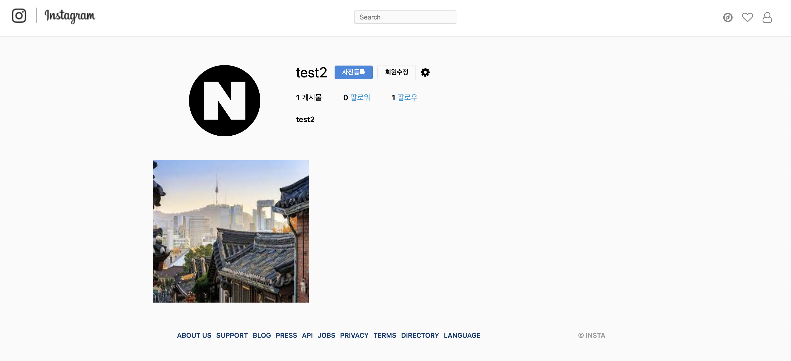
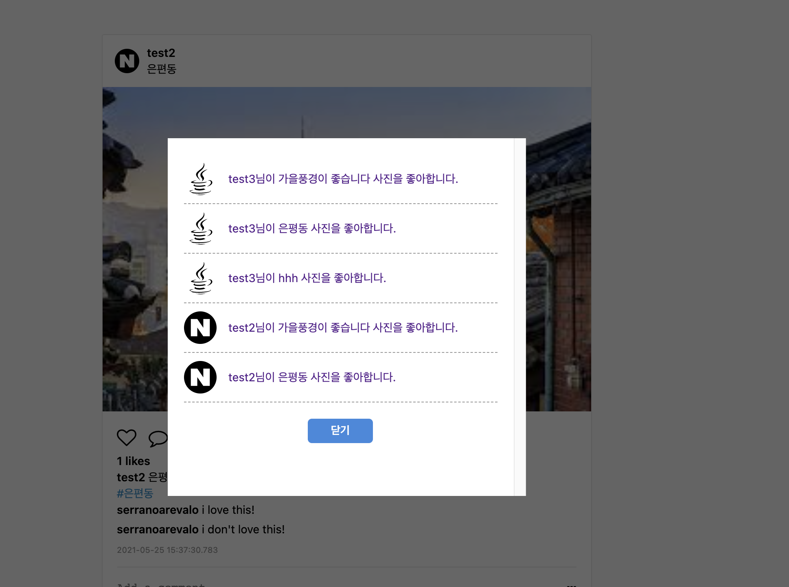

> 인스타그램 클론코딩입니다.
> 
# Instagram 
 - Skill : Spring boot, JPA, MySQL, Security, JSP
 
## Side Prodjct

 - 회원가입, 로그인 구현
   
   
 - 팔로우, 언팔로우 이벤트 구현
   
   
   
 - Spring security taglibs를 이용하여 principal 접근
 - Follow, follower 리스트 구현
   
 - 동적 팔로우, 언팔로우 이벤트 구현
 - 이미지, 태그 업로드하기
 - 이미지 리스트 완성
   
 - 이미지 액박 오류 수정
 - feed 무한스크롤 테스트
 - 이미지 페이징 무한 스크롤 구현
 - 프로파일 이미지 업로드
   
   
 - 이미지 좋아요 하기
  

---------------------------------------------------

### 추후 React로 인스타 작업할 예정.
